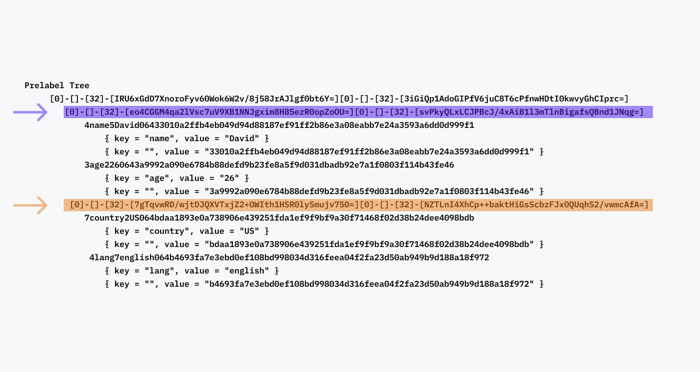
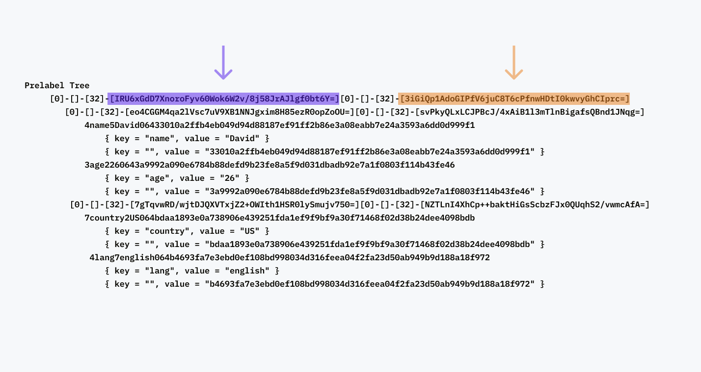

# Typed Hash Trees

Welcome to typed hash trees.

This repo/library is a work in progress and is not implemented in a useful/optimal way for anything aside from testing.

```bash
cargo run --example typed
```

#### Fixed input (for testing)

In a typed hash tree, each input keypair needs a secondary random string value `{ type = "", value = "RANDOM-VALUE"}` to make the tree brute force resistent.

```rust
// pair 1
{ key = "name", value = "David" }
{ key = "", value = "33010a2ffb4eb049d94d88187ef91ff2b86e3a08eabb7e24a3593a6dd0d999f1" }
// pair 2
{ key = "age", value = "26" }
{ key = "", value = "3a9992a090e6784b88defd9b23fe8a5f9d031dbadb92e7a1f0803f114b43fe46" }
// pair 3
{ key = "country", value = "US" }
{ key = "", value = "bdaa1893e0a738906e439251fda1ef9f9bf9a30f71468f02d38b24dee4098bdb" }
// pair 4
{ key = "lang", value = "english" }
{ key = "", value = "b4693fa7e3ebd0ef108bd998034d316feea04f2fa23d50ab949b9d188a18f972" }
```

#### Expected output

```
Hash Tree
╰─  BimO2+ZFmsmi5Zq1vshaZajKwO2yj24gPlJ6rOXjNo4=
    ├─  IRU6xGdD7XnoroFyv60Wok6W2v/8j58JrAJlgf0bt6Y=
    │   ├─  eo4CGGM4qa2lVsc7uV9XB1NNJgxim8H85ezR0opZoOU=
    │   │   ├─  VxWF6Xxj0z1RR6mqXjyRspAQXazb+ZHNpoM93Ibzg6E=
    │   │   ╰─  j2eEc0oqJvluyDaHnGk5Gd6QvRkjEq52C8tiUUfHayw=
    │   ├─  svPkyQLxLCJPBcJ/4xAiB1l3mTlnBigafsQBnd1JNqg=
    │   │   ├─  G5AYuX9soGTM01fhHirHUz1ycekLpVPaqV/KHb7KfGs=
    │   │   ╰─  agWMOAOQqNKufx/IWw+6JDDZswrXSuk0uK52GejaBIM=
    ╰─  3iGiQp1AdoGIPfV6juC8T6cPfnwHDtI0kwvyGhCIprc=
        ├─  7gTqvwRD/wjtDJQXVTxjZ2+OWIth1HSR0lySmujv750=
        │   ├─  eRpsch+mjWR0BXhFPGxh4Aw5Cm4ai27PmnylfpUco6g=
        │   ╰─  yXJ1mx0fHzcbOjSiOGl2rUIYO6hF9iR4cuC+Ny6Uq40=
        ╰─  NZTLnI4XhCp++baktHiGsScbzFJx0QUqhS2/vwmcAfA=
            ├─  WXxPNc7xZ69EC/WtVuFW+uswI7wzL3ujozRDbM8122g=
            ╰─  HfeH+//BP3Z06cfCHu2mW442IM1Dv3+ZyX4d1VdSi4c=
```

# Walkthrough

First thing we need to specify a set of keypairs we'd like to encode with a tree. All of the examples currently use the same set of keypairs as noted above.

We'll also highlight through out the following images so it's easier to see how the data is hashed.


#### The tree

Taking the keypairs, we'll want to construct a tree from these 8 bottom nodes (4 keypairs, 4 random value types).


Now that we know what structure we are going to build, the highlighting of internal nodes is helpful for understanding where the following text output is located in the tree.


#### Constructing prelabels

When construting the first level up from a tree, well want to take the two children - create prelabels - concatenate them together - hash them and encode the output in a serializable format.

To create a prelabel we will follow this format

```python
len(child_1.type) + child_1.type + len(child_1.label) + child_1.label + \
len(child_2.type) + child_2.type + len(child_2.label) + child_2.label
```

Other considerations in the following examples are the hash function used, and the encoding schema.

We'll be using.

```bash
SHA2-256
Base64
```

All of the following images are representations of the trees prelabels.

Also for reaabilty (not included in the real specification) we've included brackets around each value ie: `-[value]-`.

This does impact the trees output, but for these early demonstrations it makes it eaiser to see the process step by step (will be removed in v0.0.1)


If we follow the prelabels color to it's parents prelabel, we can see how the values are hashed, encoded and then included in the prelabel.  


We repeat the process up the tree. Using the parent lables we generated in their parents labels.



Finally we can use the last 2 internal nodes to create the prelabel and label for the root! You should be able to validate any of these pre-label -> hash values by hashing the prelabel and encoding in base64.



Heres a python snippet to check the roots prelabel

```python
import base64
import hashlib

base64.b64encode(hashlib.sha256("[0]-[]-[32]-[IRU6xGdD7XnoroFyv60Wok6W2v/8j58JrAJlgf0bt6Y=][0]-[]-[32]-[3iGiQp1AdoGIPfV6juC8T6cPfnwHDtI0kwvyGhCIprc=]".encode()).digest())

# b'BimO2+ZFmsmi5Zq1vshaZajKwO2yj24gPlJ6rOXjNo4='
```
