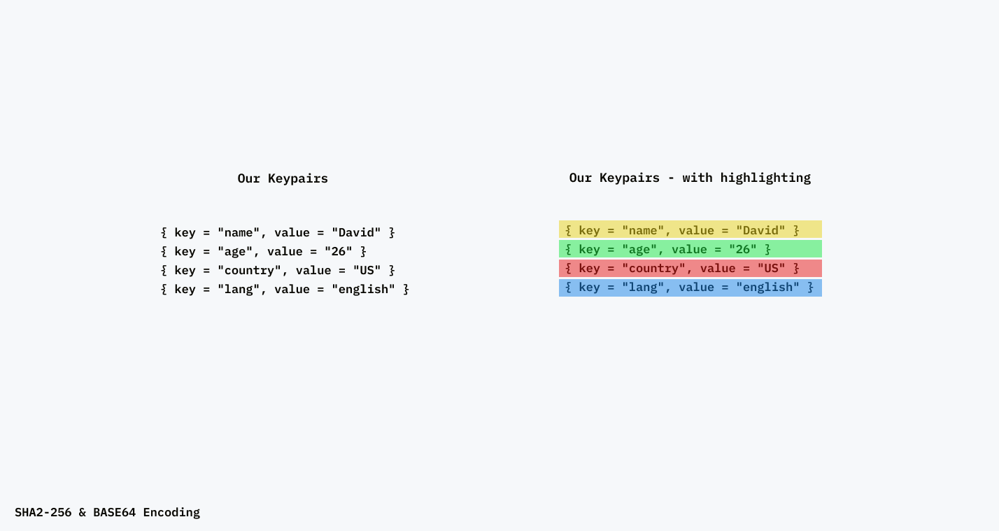

## Typed Hash Trees

Welcome to typed hash trees.

This repo/library is a work in progress and is not implemented in a useful/optimal way for anything aside from testing.

```bash
cargo run --example typed
```

#### Fixed input (for testing)

```rust
{ key = "name", value = "David" }
{ key = "age", value = "26" }
{ key = "country", value = "US" }
{ key = "lang", value = "english" }
```

#### Expected output

```
Hash Tree
╰─  BimO2+ZFmsmi5Zq1vshaZajKwO2yj24gPlJ6rOXjNo4=
    ├─  IRU6xGdD7XnoroFyv60Wok6W2v/8j58JrAJlgf0bt6Y=
    │   ├─  eo4CGGM4qa2lVsc7uV9XB1NNJgxim8H85ezR0opZoOU=
    │   │   ├─  VxWF6Xxj0z1RR6mqXjyRspAQXazb+ZHNpoM93Ibzg6E=
    │   │   ├─  j2eEc0oqJvluyDaHnGk5Gd6QvRkjEq52C8tiUUfHayw=
    │   ├─  svPkyQLxLCJPBcJ/4xAiB1l3mTlnBigafsQBnd1JNqg=
    │   │   ├─  G5AYuX9soGTM01fhHirHUz1ycekLpVPaqV/KHb7KfGs=
    │   │   ├─  agWMOAOQqNKufx/IWw+6JDDZswrXSuk0uK52GejaBIM=
    ╰─  3iGiQp1AdoGIPfV6juC8T6cPfnwHDtI0kwvyGhCIprc=
        ├─  7gTqvwRD/wjtDJQXVTxjZ2+OWIth1HSR0lySmujv750=
        │   ├─  eRpsch+mjWR0BXhFPGxh4Aw5Cm4ai27PmnylfpUco6g=
        │   ├─  yXJ1mx0fHzcbOjSiOGl2rUIYO6hF9iR4cuC+Ny6Uq40=
        ╰─  NZTLnI4XhCp++baktHiGsScbzFJx0QUqhS2/vwmcAfA=
            ├─  WXxPNc7xZ69EC/WtVuFW+uswI7wzL3ujozRDbM8122g=
            ╰─  HfeH+//BP3Z06cfCHu2mW442IM1Dv3+ZyX4d1VdSi4c=
```




